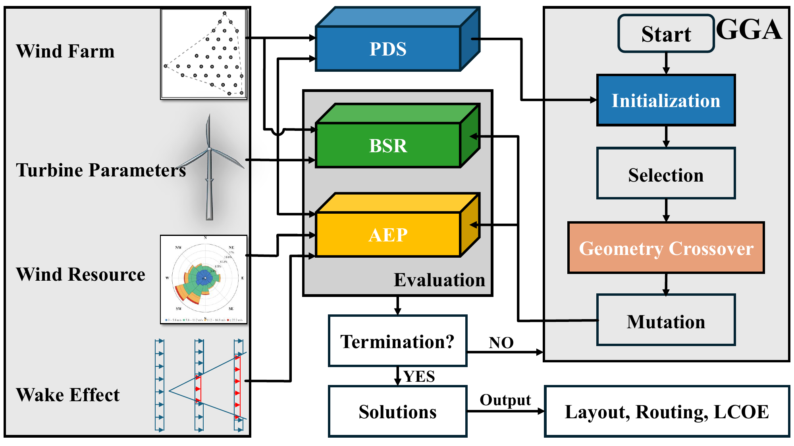
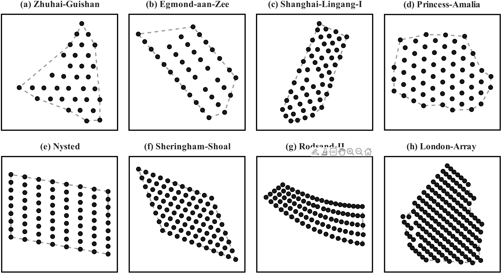
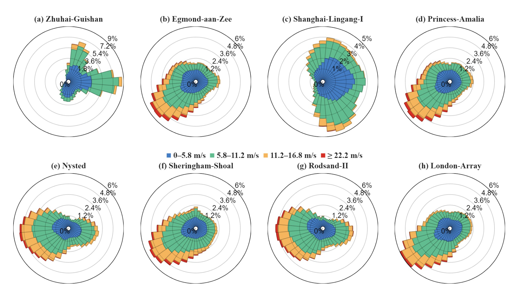
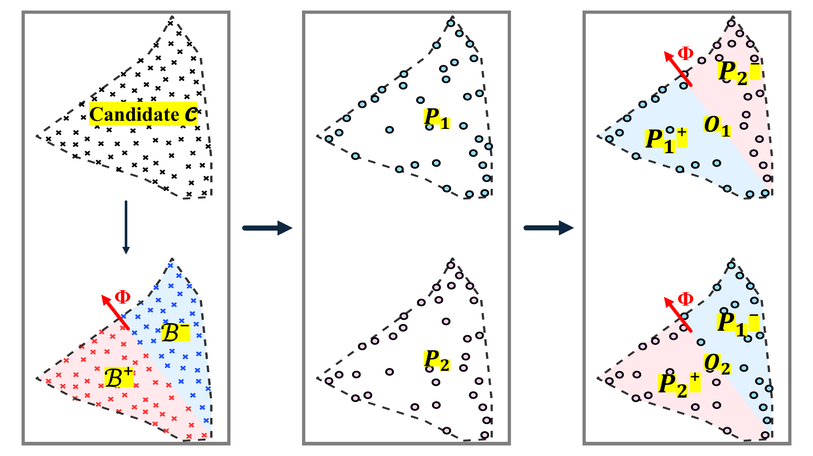
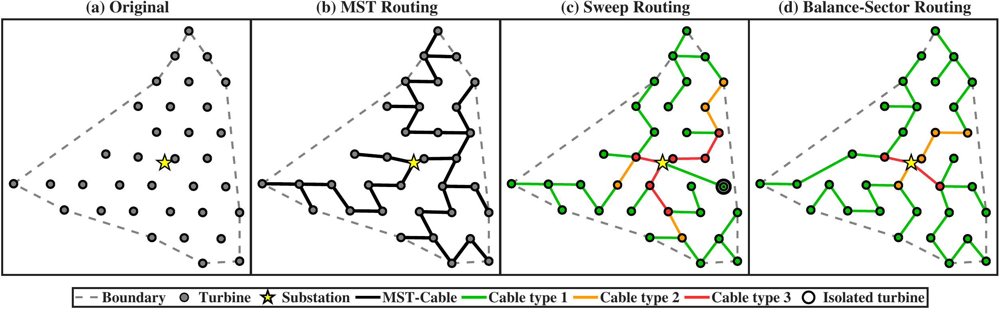
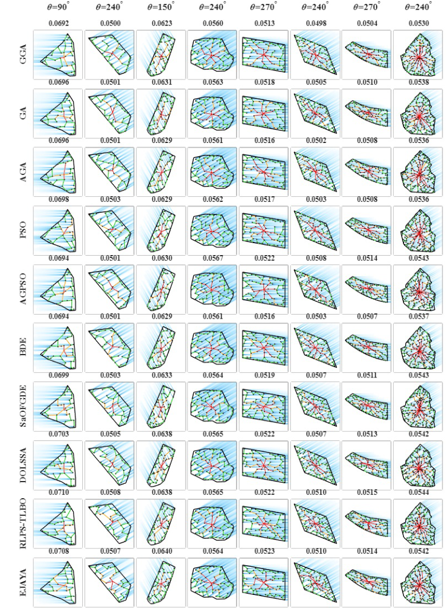

<div align="center">

# WFLO-GGA

**An Engineering Optimization Platform for Integrated Offshore Wind Farm**
**Layout and Electrical Cable Routing**

*Under review at Applied Energy*


</div>

---

## Overview

Offshore wind farm layout and cable routing are intrinsically coupled: larger turbine spacing reduces wake losses but increases cable length and cost. Optimizing them jointly—rather than sequentially—can meaningfully reduce the Levelized Cost of Energy (LCOE).

This repository provides a complete evaluation platform for this joint problem. It implements a **geometry-guided genetic algorithm (GGA)** and a **balance-sector routing (BSR)** strategy, together with nine competing algorithms and two alternative routing methods, all evaluated on a **benchmark dataset of 8 real offshore wind farms**. Every comparison uses an identical evaluation pipeline (wake model → AEP → CAPEX/OPEX → LCOE), ensuring that observed performance differences reflect algorithmic behavior rather than implementation artifacts.

<p align="center">
  
  <br><em>Figure 1. Overall framework of the proposed GGA. Optimization algorithms interact only with the top-level interface; all engineering models are encapsulated in the evaluation stack.</em>
</p>

---

## Key Results

The table below summarizes the main quantitative claims reported in the paper. These results are fully reproducible using the configuration described in [Reproducing Paper Results](#reproducing-paper-results).

### LCOE Reduction by GGA (BSR routing, 30 runs, population 30, 100 iterations)

| Site | (a) | (b) | (c) | (d) | (e) | (f) | (g) | (h) | **Avg** |
|:-----|:---:|:---:|:---:|:---:|:---:|:---:|:---:|:---:|:-------:|
| Reduction (%) | 4.09 | 2.46 | 3.64 | 1.74 | 2.52 | 2.97 | 2.81 | 2.82 | **2.88** |

GGA achieves Friedman rank 1.00 and an 8/0/0 win–tie–loss record (Wilcoxon rank-sum test, α = 0.05) against all nine competing algorithms under all three routing configurations.

### BSR Cable Cost Reduction vs. Sweep (averaged across all 10 algorithms)

| Site | (a) | (b) | (c) | (d) | (e) | (f) | (g) | (h) |
|:-----|:---:|:---:|:---:|:---:|:---:|:---:|:---:|:---:|
| Reduction (%) | 10.60 | 5.30 | 4.90 | 2.60 | 1.60 | 1.60 | 3.40 | 0.90 |

Per-algorithm range: 2.84% (GGA) to 4.51% (AGPSO), averaged across all 8 sites.

---

## Benchmark Sites

<p align="center">
  
  <br><em>Figure 2. Geographic boundaries and Poisson-disk-sampled candidate turbine positions for the 8 benchmark sites.</em>
</p>

<p align="center">
  
  <br><em>Figure 3. Directional wind speed distributions for the 8 benchmark sites.</em>
</p>

Eight operational offshore wind farms are included, spanning four countries and representing diverse boundary geometries, wind regimes, and problem scales:

| ID | `case_list` name | Country | Cap. (MW) | Turbines | Boundary Type |
|:--:|:-----------------|:-------:|:---------:|:--------:|:--------------|
| (a) | `China_Zhuhai_Guishan_Hai` | China | 120.0 | 34 | Semi-irregular |
| (b) | `Netherlands_Egmond_aan_Zee` | Netherlands | 108.0 | 36 | Semi-irregular |
| (c) | `China_Shanghai_Lingang` | China | 100.0 | 56 | Semi-irregular |
| (d) | `Netherlands_Prinses_Amaliawindpark` | Netherlands | 120.0 | 61 | Irregular |
| (e) | `Denmark_Nysted` | Denmark | 165.6 | 72 | Regular |
| (f) | `UK_Sheringham_Shoal` | UK | 316.8 | 88 | Regular |
| (g) | `Denmark_Rodsand_II` | Denmark | 207.0 | 90 | Semi-irregular |
| (h) | `UK_London_Array` | UK | 630.0 | 175 | Irregular |

**Each site provides**: geographic boundary polygon (GeoJSON), original turbine positions (CSV), and directional wind speed distribution (16 sectors, `.mat`). Candidate turbine positions for optimization are generated at runtime via Poisson-disk sampling with a minimum spacing of 3 rotor diameters.

> **Data sources**: Wind resource data are derived from the [Global Wind Atlas](https://globalwindatlas.info) (ERA5-based microscale downscaling). Site boundaries and turbine positions are sourced from the global wind farm repository of [Zhang et al. (2021)](https://doi.org/10.1038/s41597-021-00982-z). See [Data Sources](#data-sources--acknowledgments) for full attribution.

---

## Method: GGA and BSR

### Geometry-guided Crossover (G-crossover)

<p align="center">
  
  <br><em>Figure 4. G-crossover partitions each parent layout into two complementary half-planes and exchanges spatial segments between parents. The dividing angle φ is resampled each generation.</em>
</p>

Standard genetic crossover operates on integer indices and disrupts spatial structure, generating infeasible offspring that require repair. G-crossover instead partitions the wind farm into **two complementary half-planes** defined by a random line through the offshore substation. The partition is performed in **Euclidean space using a signed dot product** — no polar coordinate assumption is required, and the operator is valid for any irregular boundary geometry. Turbines within each half-plane are inherited as a coherent group, preserving locally favorable spatial configurations.

For wind farms with regular grid-like geometries, G-crossover remains applicable; however, its relative advantage over random crossover may be smaller, since random operators are less likely to disrupt spatially coherent configurations in uniform layouts. This is consistent with the benchmark results: the performance margin of GGA is smaller at regular sites (Egmond-aan-Zee, Nysted) than at irregular sites (Shanghai-Lingang, London Array).

### Balance-Sector Routing (BSR)

<p align="center">
  
  <br><em>Figure 5. Cable routing strategy comparison on a representative site. BSR achieves balanced branch loading (4 groups of {9, 8, 9, 8} turbines) compared to Sweep's fragmented allocation.</em>
</p>

BSR maps turbines to polar angles relative to the substation, partitions them into angular sectors of approximately equal size, and constructs a local MST within each sector. A rotational search over up to T_max starting positions selects the configuration with minimum total cable cost. This design ensures capacity feasibility, reduces high-grade cable usage, and achieves lower total cable cost than Sweep in most configurations.

---

## Algorithm Suite

Ten metaheuristic algorithms are implemented as interchangeable solvers. All use the same chromosome encoding (a set of *M* distinct candidate-point indices), the same evaluation pipeline, and the same initial population.

| Algorithm | Category | Key Mechanism | Reference |
|:----------|:---------|:--------------|:----------|
| **GGA** ★ | Genetic | Half-plane crossover in Euclidean space | This work |
| GA | Genetic | Single-point crossover · elitism | — |
| AGA | Genetic | Adaptive mutation and crossover rates | [Ju et al. 2019](https://doi.org/10.1016/j.apenergy.2019.04.084) |
| BPSO | Swarm | Binary PSO with top-M velocity ranking | — |
| AGPSO | Hybrid | GA + PSO with stagnation recovery | [Lei et al. 2022](https://doi.org/10.1016/j.enconman.2022.116174) |
| BDE | Differential Evolution | Ranking-based pBest/pWorst mutation | [Li et al. 2025](https://doi.org/10.1016/j.energy.2025.137885) |
| SaOFGDE | Differential Evolution | Fractional-order historical memory · adaptive CR | [Zhang et al. 2025](https://doi.org/10.1016/j.energy.2025.135866) |
| DOLSSA | Swarm | Opposition-based learning Sparrow Search | [Zhu et al. 2024](https://doi.org/10.1155/2024/4322211) |
| RLPS_TLBO | Learning-based | Q-learning phase selection in TLBO | [Yu et al. 2024](https://doi.org/10.1016/j.asoc.2024.111135) |
| EJAYA | Learning-based | Enhanced Jaya with attraction/repulsion | [Zhang et al. 2021](https://doi.org/10.1016/j.knosys.2021.107555) |

All competitor algorithms use hyperparameter values from their original publications without site-specific tuning. The complete parameter configurations are listed in Table B.9 of the paper.

---

## Repository Structure

```
WFLO-GGA/
├── main.m                      # Experiment entry point
├── alg/                        # Algorithm implementations
│   ├── GGA.m                   # ★ Proposed method
│   ├── GA.m / AGA.m            # Genetic algorithm variants
│   ├── BPSO.m / AGPSO.m        # Swarm intelligence variants
│   ├── BDE.m / SaOFGDE.m       # Differential evolution variants
│   ├── DOLSSA.m                # Sparrow search variant
│   ├── RLPS_TLBO.m             # Teaching-learning variant
│   └── EJAYA.m                 # Jaya variant
├── utils/
│   ├── evaluate.m              # LCOE / AEP evaluation (core model)
│   ├── cr_sector.m             # Balance-Sector Routing (BSR)
│   ├── cr_mst.m                # Minimum Spanning Tree routing
│   ├── cr_sweep.m              # Sweep-line routing
│   ├── load_problem_poisson.m  # Site loader + Poisson-disk sampling
│   ├── load_layout.m           # Lat/lon to Cartesian projection
│   └── unique_fix.m            # Chromosome feasibility repair
├── data/
│   ├── layout/                 # Boundary polygons (GeoJSON) and turbine positions (CSV)
│   ├── wind/                   # Directional wind distributions (MAT, 16 sectors)
│   ├── turbine/                # Power curve and turbine parameters
│   └── OWF8.qgz                # Compressed archive of all benchmark data (QGIS format)
└── figures/                    # README figures
```

---

## Quick Start

### Requirements

- MATLAB R2018a or later
- No external toolboxes required for core functionality
- Parallel Computing Toolbox (optional, for `parfor`-based multi-run parallelism)

### Steps

**1. Clone the repository**

```bash
git clone https://github.com/zbh0528/WFLO-GGA.git
cd WFLO-GGA
```

**2. Open MATLAB and add to path**

```matlab
addpath(genpath(pwd));
```

**3. Quick single-run test** (site (a), GGA only, ~1–2 minutes)

```matlab
cfg.routing_fn = @cr_sector;
cfg.algorithms = { @GGA };
cfg.algonames  = { 'GGA' };
cfg.case_list  = { 'China_Zhuhai_Guishan_Hai' };
cfg.popsize    = 30;
cfg.max_it     = 100;
cfg.runTime    = 1;
cfg.base_seed  = 42;
main
```

**4. Full comparison experiment** (all 10 algorithms × 8 sites × 30 runs)

```matlab
cfg.routing_fn = @cr_sector;
cfg.algorithms = { @GGA, @GA, @AGA, @BPSO, @AGPSO, @BDE, @SaOFGDE, @DOLSSA, @RLPS_TLBO, @EJAYA };
cfg.algonames  = { 'GGA', 'GA', 'AGA', 'BPSO', 'AGPSO', 'BDE', 'SaOFGDE', 'DOLSSA', 'RLPS_TLBO', 'EJAYA' };
cfg.case_list  = { 'China_Zhuhai_Guishan_Hai', 'Netherlands_Egmond_aan_Zee', ...
                   'China_Shanghai_Lingang', 'Netherlands_Prinses_Amaliawindpark', ...
                   'Denmark_Nysted', 'UK_Sheringham_Shoal', ...
                   'Denmark_Rodsand_II', 'UK_London_Array' };
cfg.popsize    = 30;
cfg.max_it     = 100;
cfg.runTime    = 30;
cfg.base_seed  = 42;
main
```

Results are saved to `results/results_YYYYMMDD_HHMMSS/`.

---

## Reproducing Paper Results

The following configurations reproduce the main tables and figures in the paper. All experiments use `cfg.base_seed = 42`, `cfg.popsize = 30`, `cfg.max_it = 100`, `cfg.runTime = 30`.

| Paper item | `routing_fn` | Notes |
|:-----------|:-------------|:------|
| Table 2 — LCOE comparison (BSR) | `@cr_sector` | `global_run_summary.csv` |
| Table 3 — LCOE reduction summary | `@cr_sector` | Compute reduction from initial vs. final generation |
| Table 4 — AEP comparison | `@cr_sector` | AEP field in `run_N_summary.mat` |
| Table 5 — Wake efficiency | `@cr_sector` | Wake efficiency field in `run_N_summary.mat` |
| Table 6 — BSR vs. Sweep cost reduction | `@cr_sector` + `@cr_sweep` | Compare cable cost fields across both runs |
| Table C.1 — MST results | `@cr_mst` | `global_run_summary.csv` |
| Table C.2 — Sweep results | `@cr_sweep` | `global_run_summary.csv` |
| Figure 7 — Convergence curves | `@cr_sector` | `run_summary.csv` per algorithm/site |
| Figure 8 — Box plots | `@cr_sector` | `run_N_summary.mat` across 30 runs |

> The candidate point set is generated once via Poisson-disk sampling and shared across all algorithms in a given experiment. With `cfg.base_seed = 42`, this sampling is deterministic and the reported results are exactly reproducible.

---

## Output Structure

```
results/
└── results_YYYYMMDD_HHMMSS/
    ├── global_run_summary.csv        ← LCOE across all cases and algorithms
    ├── metadata/
    │   ├── config_snapshot.mat       ← full experiment configuration
    │   └── environment_info.mat      ← MATLAB version, hardware info
    └── {site_name}/
        └── {algorithm}/
            ├── run_summary.csv
            ├── run_N_summary.mat     ← best LCOE, AEP, wake efficiency per run
            └── {algorithm}_runN.mat ← complete generation history:
                                        population, fitness, AEP, wake efficiency,
                                        cable topology, timing breakdown
```

---

## Optimized Layout Example

<p align="center">
  
  <br><em>Figure 6. Representative best layouts produced by all 10 algorithms across the 8 benchmark sites under BSR routing. Each column is a wind farm; each row is an algorithm. Wake fields are visualized under the prevailing wind direction.</em>
</p>

---

## Data Sources & Acknowledgments

This benchmark uses exclusively public, verifiable data:

| Data | Source | Reference |
|:-----|:-------|:----------|
| Wind resource (16-sector distributions) | Global Wind Atlas v3, ERA5-based microscale downscaling | Davis et al. (2023) |
| Site boundaries and turbine positions | Global wind farm repository | Zhang et al. (2021) |
| CAPEX cost coefficients | Dicorato et al. (2011); Gonzalez-Rodriguez (2017) |
| OPEX benchmark value (86 $/kW/year) | NREL 2018 Cost of Wind Energy Review |
| Cable cost parameters | Kirchner-Bossi & Porté-Agel (2024) |

If you use the benchmark dataset, please additionally cite:

```bibtex
@article{zhang2021global,
  title   = {A global-scale wind power assessment},
  author  = {Zhang, S. and others},
  journal = {Scientific Data},
  year    = {2021},
  doi     = {10.1038/s41597-021-00982-z}
}
```

---

## Citation

If you use this platform, dataset, or any algorithm implementation in your research, please cite:

```bibtex
@article{zhang2026wflogga,
  title   = {A Geometry-guided Genetic Algorithm for Integrated Offshore Wind Farm
             Layout and Electrical Cable Routing Optimization},
  author  = {Zhang, Baohang and Shao, Yixin and Lei, Zhenyu and Zhang, Chao
             and Wang, Yirui and Gao, Shangce},
  journal = {Applied Energy},
  year    = {2026},
  note    = {Under review}
}
```

---

## License

Released for academic and non-commercial research purposes. Please contact the authors ([gaosc@eng.u-toyama.ac.jp](mailto:gaosc@eng.u-toyama.ac.jp)) prior to any commercial use of the benchmark dataset or source code.
