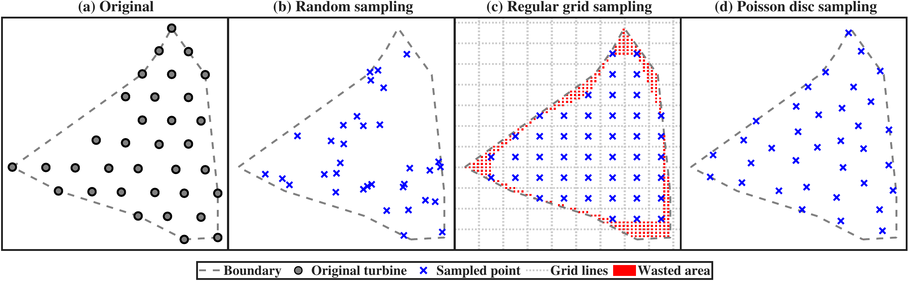

<div align="center">

# WFLO-GGA

**An Engineering Optimization Platform for Integrated Offshore Wind Farm**
**Layout and Electrical Cable Routing**

*Under review at Applied Energy*


</div>

---

## Table of Contents

- [Overview](#overview)
- [Key Results](#key-results)
- [Benchmark Sites](#benchmark-sites)
- [Method: GGA and BSR](#method-gga-and-bsr)
  - [Candidate Point Generation (Poisson-Disk Sampling)](#candidate-point-generation-poisson-disk-sampling)
  - [Geometry-guided Crossover (G-crossover)](#geometry-guided-crossover-g-crossover)
  - [Balance-Sector Routing (BSR)](#balance-sector-routing-bsr)
- [Algorithm Suite](#algorithm-suite)
- [Experimental Design & Fairness Protocol](#experimental-design--fairness-protocol)
- [Extending the Platform](#extending-the-platform)
  - [Adding a New Algorithm](#adding-a-new-algorithm)
  - [Warm-Start and Population Transfer](#warm-start-and-population-transfer)
  - [Multi-Routing Comparison Workflow](#multi-routing-comparison-workflow)
  - [Swapping the Turbine Model](#swapping-the-turbine-model)
  - [Configuring the Substation Position](#configuring-the-substation-position)
  - [Enabling Spatially Varying Bathymetry](#enabling-spatially-varying-bathymetry)
  - [Replacing the Wake Model](#replacing-the-wake-model)
  - [Refining Wind Resource Discretization](#refining-wind-resource-discretization)
  - [Adding a New Wind Farm Site](#adding-a-new-wind-farm-site)
- [Repository Structure](#repository-structure)
- [Quick Start](#quick-start)
- [Reproducing Paper Results](#reproducing-paper-results)
- [Output Structure](#output-structure)
- [Post-Processing & Analysis](#post-processing--analysis)
- [Optimized Layout Example](#optimized-layout-example)
- [Data Sources & Acknowledgments](#data-sources--acknowledgments)
- [Citation](#citation)
- [License](#license)

---

## Overview

Offshore wind farm layout and cable routing are intrinsically coupled: larger turbine spacing reduces wake losses but increases cable length and cost. Optimizing them jointly—rather than sequentially—can meaningfully reduce the Levelized Cost of Energy (LCOE).

This repository provides a complete evaluation platform for this joint problem. It implements a **geometry-guided genetic algorithm (GGA)** and a **balance-sector routing (BSR)** strategy, together with nine competing algorithms and two alternative routing methods, all evaluated on a **benchmark dataset of 8 real offshore wind farms**. Every comparison uses an identical evaluation pipeline (wake model → AEP → CAPEX/OPEX → LCOE), ensuring that observed performance differences reflect algorithmic behavior rather than implementation artifacts.

<p align="center">
  
  <br><em>Figure 1. Overall framework of the proposed GGA. Optimization algorithms interact only with the top-level interface; all engineering models are encapsulated in the evaluation stack.</em>
</p>

---

## Key Results

The table below summarizes the main quantitative claims reported in the paper. These results are fully reproducible using the configuration described in [Reproducing Paper Results](#reproducing-paper-results).

### LCOE Reduction by GGA (BSR routing, 30 runs, population 30, 100 iterations)

| Site | (a) | (b) | (c) | (d) | (e) | (f) | (g) | (h) | **Avg** |
|:-----|:---:|:---:|:---:|:---:|:---:|:---:|:---:|:---:|:-------:|
| Reduction (%) | 4.09 | 2.46 | 3.64 | 1.74 | 2.52 | 2.97 | 2.81 | 2.82 | **2.88** |

GGA achieves Friedman rank 1.00 and an 8/0/0 win–tie–loss record (Wilcoxon rank-sum test, α = 0.05) against all nine competing algorithms under all three routing configurations.

### BSR Cable Cost Reduction vs. Sweep (averaged across all 10 algorithms)

| Site | (a) | (b) | (c) | (d) | (e) | (f) | (g) | (h) |
|:-----|:---:|:---:|:---:|:---:|:---:|:---:|:---:|:---:|
| Reduction (%) | 10.60 | 5.30 | 4.90 | 2.60 | 1.60 | 1.60 | 3.40 | 0.90 |

Per-algorithm range: 2.84% (GGA) to 4.51% (AGPSO), averaged across all 8 sites.

---

## Benchmark Sites

<p align="center">
  
  <br><em>Figure 2. Geographic boundaries and Poisson-disk-sampled candidate turbine positions for the 8 benchmark sites.</em>
</p>

<p align="center">
  
  <br><em>Figure 3. Directional wind speed distributions for the 8 benchmark sites.</em>
</p>

Eight operational offshore wind farms are included, spanning four countries and representing diverse boundary geometries, wind regimes, and problem scales:

| ID | `case_list` name | Country | Cap. (MW) | Turbines | Boundary Type |
|:--:|:-----------------|:-------:|:---------:|:--------:|:--------------|
| (a) | `China_Zhuhai_Guishan_Hai` | China | 120.0 | 34 | Semi-irregular |
| (b) | `Netherlands_Egmond_aan_Zee` | Netherlands | 108.0 | 36 | Semi-irregular |
| (c) | `China_Shanghai_Lingang` | China | 100.0 | 56 | Semi-irregular |
| (d) | `Netherlands_Prinses_Amaliawindpark` | Netherlands | 120.0 | 61 | Irregular |
| (e) | `Denmark_Nysted` | Denmark | 165.6 | 72 | Regular |
| (f) | `UK_Sheringham_Shoal` | UK | 316.8 | 88 | Regular |
| (g) | `Denmark_Rodsand_II` | Denmark | 207.0 | 90 | Semi-irregular |
| (h) | `UK_London_Array` | UK | 630.0 | 175 | Irregular |

**Each site provides**: geographic boundary polygon (GeoJSON), original turbine positions (CSV), and directional wind speed distribution (12 sectors × 4 wind speed bins, `.mat`). Candidate turbine positions for optimization are generated at runtime via Poisson-disk sampling with a minimum spacing of 3 rotor diameters.

> **Additional site**: `Denmark_Horns_Rev_1` (80 turbines, regular grid) is available in the data directory but excluded from the main benchmark. It can be added to `cfg.case_list` directly.

> **Data sources**: Wind resource data are derived from the [Global Wind Atlas](https://globalwindatlas.info) (ERA5-based microscale downscaling). Site boundaries and turbine positions are sourced from the global wind farm repository of [Zhang et al. (2021)](https://doi.org/10.1038/s41597-021-00982-z). See [Data Sources & Acknowledgments](#data-sources--acknowledgments) for full attribution.

---

## Method: GGA and BSR

### Candidate Point Generation (Poisson-Disk Sampling)

<p align="center">
  
  <br><em>Figure 4. Poisson-disk-sampled candidate turbine positions for two representative sites. The minimum inter-point distance equals 3 rotor diameters (351 m), ensuring that any selected subset automatically satisfies the spacing constraint.</em>
</p>

Before optimization begins, each wind farm boundary is populated with candidate turbine positions using **Bridson's Poisson-disk sampling algorithm**. This step serves two purposes: it enforces the minimum turbine spacing constraint (3 rotor diameters, 351 m) structurally, so no repair step is required during optimization; and it provides a shared, reproducible search space for all ten algorithms.

The sampling procedure is as follows:

1. The boundary polygon is extracted from the GeoJSON file and used as a feasibility mask.
2. Bridson's algorithm generates points inside the polygon such that no two points are closer than the minimum spacing *r*. If the initial *r* yields fewer candidates than the required turbine count *M*, *r* is reduced by 1% and the procedure repeats.
3. The resulting *N* candidate points are fixed for the entire experiment session. All algorithms search within the same discrete set `{1, …, N}`, selecting *M* indices as a layout.

With `cfg.base_seed = 42`, the sampling is deterministic and identical across all algorithms and runs, ensuring that observed performance differences reflect algorithmic behavior rather than differences in the feasible search space.

### Geometry-guided Crossover (G-crossover)

<p align="center">
  
  <br><em>Figure 5. G-crossover partitions each parent layout into two complementary half-planes and exchanges spatial segments between parents. The dividing angle φ is resampled each generation.</em>
</p>

Standard genetic crossover operates on integer indices and disrupts spatial structure, generating infeasible offspring that require repair. G-crossover instead partitions the wind farm into **two complementary half-planes** defined by a random line through the offshore substation. The partition is performed in **Euclidean space using a signed dot product** — no polar coordinate assumption is required, and the operator is valid for any irregular boundary geometry. Turbines within each half-plane are inherited as a coherent group, preserving locally favorable spatial configurations.

For wind farms with regular grid-like geometries, G-crossover remains applicable; however, its relative advantage over random crossover may be smaller, since random operators are less likely to disrupt spatially coherent configurations in uniform layouts. This is consistent with the benchmark results: the performance margin of GGA is smaller at regular sites (Egmond-aan-Zee, Nysted) than at irregular sites (Shanghai-Lingang, London Array).

### Balance-Sector Routing (BSR)

<p align="center">
  
  <br><em>Figure 6. Cable routing strategy comparison on a representative site. BSR achieves balanced branch loading (4 groups of {9, 8, 9, 8} turbines) compared to Sweep's fragmented allocation.</em>
</p>

BSR maps turbines to polar angles relative to the substation, partitions them into angular sectors of approximately equal size, and constructs a local MST within each sector. A rotational search over up to T_max starting positions selects the configuration with minimum total cable cost. This design ensures capacity feasibility, reduces high-grade cable usage, and achieves lower total cable cost than Sweep in most configurations.

---

## Algorithm Suite

Ten metaheuristic algorithms are implemented as interchangeable solvers. All use the same chromosome encoding (a set of *M* distinct candidate-point indices), the same evaluation pipeline, and the same initial population.

| Algorithm | Category | Key Mechanism | Reference |
|:----------|:---------|:--------------|:----------|
| **GGA** ★ | Genetic | Half-plane crossover in Euclidean space | This work |
| GA | Genetic | Single-point crossover · elitism | — |
| AGA | Genetic | Adaptive mutation and crossover rates | [Ju et al. 2019](https://doi.org/10.1016/j.apenergy.2019.04.084) |
| BPSO | Swarm | Binary PSO with top-M velocity ranking | — |
| AGPSO | Hybrid | GA + PSO with stagnation recovery | [Lei et al. 2022](https://doi.org/10.1016/j.enconman.2022.116174) |
| BDE | Differential Evolution | Ranking-based pBest/pWorst mutation | [Li et al. 2025](https://doi.org/10.1016/j.energy.2025.137885) |
| SaOFGDE | Differential Evolution | Fractional-order historical memory · adaptive CR | [Zhang et al. 2025](https://doi.org/10.1016/j.energy.2025.135866) |
| DOLSSA | Swarm | Opposition-based learning Sparrow Search | [Zhu et al. 2024](https://doi.org/10.1155/2024/4322211) |
| RLPS_TLBO | Learning-based | Q-learning phase selection in TLBO | [Yu et al. 2024](https://doi.org/10.1016/j.asoc.2023.111135) |
| EJAYA | Learning-based | Enhanced Jaya with attraction/repulsion | [Zhang et al. 2021](https://doi.org/10.1016/j.knosys.2021.107555) |

All competitor algorithms use hyperparameter values from their original publications without site-specific tuning. The complete parameter configurations are listed in Table B.9 of the paper.

---

## Experimental Design & Fairness Protocol

All ten algorithms compete under three structural guarantees enforced by `main.m`, ensuring that observed LCOE differences reflect algorithmic behavior rather than initialization or modeling artifacts:

| Guarantee | Mechanism |
|:----------|:----------|
| **Shared candidate set** | Poisson-disk sampling is seeded with `cfg.base_seed` before any algorithm runs. All algorithms search within the same *N* candidate positions. |
| **Shared initial population** | `Pop0` is generated once per site via `prepare_initial_population()` and passed identically to every algorithm. No algorithm benefits from a more favorable starting configuration. |
| **Shared evaluation pipeline** | All algorithms call the same `evaluate.m` → `routing_fn` stack. There are no algorithm-specific model simplifications. |

The execution order within `main.m` enforces this:

```matlab
% 1. Load site and generate candidate set (shared, seeded)
[wf, turbine] = load_problem_poisson(case_name);

% 2. Generate initial population (shared across all algorithms)
[Pop0_all, wf] = prepare_initial_population(cfg, wf, turbine, case_name, runTime, popsize);

% 3. Run all algorithms on the same problem instance
for each algorithm
    for r = 1:runTime
        feval(alg, wf, turbine, max_it, r, popsize, algname, results_dir, Pop0_all{r}, routing_fn);
    end
end
```

This design means the benchmark results in the paper are directly comparable: any algorithm that outperforms another does so on the same candidate set, same starting layouts, and same physical model.

---

## Extending the Platform

### Adding a New Algorithm

All algorithms share an identical interface. To add a new solver, create `alg/MyAlg.m` with the following signature:

```matlab
function best_fit = MyAlg(wf, turbine, max_it, runtime, popsize, algname, results_dir, Pop0, routing_fn)
% Inputs:
%   wf          - wind farm struct (candidate positions, boundary, wind resource, cable params)
%   turbine     - turbine struct (power curve, thrust coefficient, rotor diameter)
%   max_it      - maximum number of iterations
%   runtime     - run index (used for output file naming and RNG seeding)
%   popsize     - population size
%   algname     - string identifier for output files
%   results_dir - path to write per-run output files
%   Pop0        - initial population (popsize × M integer matrix, each row is a chromosome)
%   routing_fn  - cable routing function handle (@cr_sector, @cr_mst, or @cr_sweep)
%
% Output:
%   best_fit    - best LCOE achieved (scalar, $/MWh; lower is better)
%
% Chromosome encoding:
%   Each individual is a length-M integer vector of distinct indices in [1, wf.N_candidate].
%   Index k selects candidate position wf.candidate_points(k, :) as a turbine location.
%   Use unique_fix(ind, wf.N_candidate) to repair infeasible chromosomes after crossover/mutation.
%
% Fitness evaluation:
%   coords = wf.candidate_points(ind, :);
%   cable  = routing_fn(coords, wf);
%   [lcoe] = evaluate(wf, turbine, cable, coords);
```

Then register it in `main.m`:

```matlab
cfg.algorithms = { @GGA, @MyAlg };
cfg.algonames  = { 'GGA', 'MyAlg' };
```

> **Porting algorithms from PlatEMO**: [PlatEMO](https://github.com/BIMK/PlatEMO) is a MATLAB-based evolutionary optimization platform that provides reference implementations of 150+ metaheuristic algorithms. To port an algorithm from PlatEMO, extract its core population update logic and wrap it in the function signature above. The key adaptation is replacing PlatEMO's internal fitness calls with `evaluate(wf, turbine, routing_fn(...), coords)`, and mapping PlatEMO's solution representation to the integer-index chromosome encoding used here.

### Warm-Start and Population Transfer

By default, `main.m` generates a random initial population. It also supports **warm-start initialization**: loading a population from a previous experiment as the starting point for a new run. This is useful for continuing interrupted experiments, transferring knowledge across sites, or seeding with domain-informed layouts.

Three configuration flags control this behavior:

```matlab
cfg.use_history_pop0                   = true;   % enable warm-start (default: true)
cfg.history_root                       = fullfile(project_root, 'Results');  % search path
cfg.allow_history_wf_override          = true;   % reuse candidate set from history session
cfg.allow_random_init_when_history_missing = true;  % fall back to random if no history found
```

When `cfg.use_history_pop0 = true`, the platform searches `cfg.history_root/{case_name}/` for `.mat` files from a previous run, extracts the final population, and uses it as `Pop0` for the new experiment. A `history_init_report.txt` is written to the output directory recording which history file was used (or why fallback occurred).

**Cross-site population transfer**: set `cfg.history_root` to point to results from a different site. The platform will attempt to map the historical population to the new candidate set, enabling transfer-learning-style initialization across wind farms.

### Multi-Routing Comparison Workflow

To reproduce Table 6 (BSR vs. Sweep cable cost comparison) or to compare any pair of routing strategies on the same algorithm, run two experiments that differ only in `cfg.routing_fn`:

```matlab
% Run 1: Balance-Sector Routing
cfg.routing_fn = @cr_sector;
cfg.algorithms = { @GGA };
cfg.algonames  = { 'GGA' };
cfg.case_list  = { 'UK_London_Array' };
cfg.popsize = 30; cfg.max_it = 100; cfg.runTime = 30; cfg.base_seed = 42;
main   % saves to results/results_YYYYMMDD_HHMMSS_bsr/

% Run 2: Sweep routing (identical config, different routing_fn)
cfg.routing_fn = @cr_sweep;
main   % saves to results/results_YYYYMMDD_HHMMSS_sweep/
```

Because both runs share the same `cfg.base_seed`, they use identical candidate sets and initial populations. The cable cost difference in `global_run_summary.csv` is therefore attributable solely to the routing strategy. To compare all three routing strategies, run the same block a third time with `cfg.routing_fn = @cr_mst`.

### Swapping the Turbine Model

The turbine is defined in two places: a **CSV power/thrust table** and a set of **scalar parameters** in `load_problem_poisson.m`.

**Step 1 — Prepare a new turbine CSV** in `data/turbine/`, with three columns (no header row):

```
speed_m_s,  power_kW,  Ct
3.0,        0,         0.00
...
13.0,       4200,      0.80
...
25.0,       4200,      0.50
```

**Step 2 — Update the turbine block** in `load_problem_poisson.m`:

```matlab
turbine_file = './data/turbine/MyTurbine_6MW.csv';

turbine.Pinst          = 6000;    % rated power (kW)
turbine.hub_height     = 105.0;   % hub height (m)
turbine.rotor_diameter = 154.0;   % rotor diameter (m)  ← drives minimum turbine spacing
turbine.rotor_radius   = turbine.rotor_diameter / 2;
turbine.CutIn          = 3.0;     % cut-in wind speed (m/s)
turbine.CutOut         = 25.0;    % cut-out wind speed (m/s)
```

**Downstream effects that update automatically:**

| Parameter | How it responds to turbine change |
|:----------|:----------------------------------|
| Poisson-disk spacing | `r = 3 × rotor_diameter` — denser or sparser candidate grid |
| Cable capacity per string | Re-derived from rated current ÷ turbine current: `floor(I_rated / I_turbine)` |
| Foundation cost | Scales with `hub_height`, `rotor_diameter`, and `Pinst` via the Dicorato model |
| Turbine CAPEX | Re-computed from `log(Pinst/1000)` cost curve |

No algorithm or routing code requires modification; all use `turbine` and `wf` as opaque structs.

### Configuring the Substation Position

The offshore substation is currently placed at the centroid of the original turbine layout:

```matlab
wf.substation = mean(layout0, 1);   % in load_problem_poisson.m
```

To test a different substation location, override this field after the site is loaded:

```matlab
[wf, turbine] = load_problem_poisson('UK_London_Array');
wf.substation = [x_coord, y_coord];   % Cartesian metres, same projection as wf.candidate_points
```

The substation position affects both the G-crossover operator (the half-plane partition line passes through it) and all three routing strategies (cable strings are rooted at it). Varying the substation position is therefore a meaningful sensitivity study and a natural extension of the joint optimization problem.

### Enabling Spatially Varying Bathymetry

By default all benchmark sites use a **uniform sea depth** (`wf.sea_depth = 7 m`), and the foundation cost in `evaluate.m` applies it uniformly:

```matlab
SD  = wf.sea_depth;                                          % scalar
C_f = 320 * PWT * (1 + 0.02*(SD - 8)) * (...);             % per-turbine cost (uniform)
toC = (C_W + C_ist + 1.5*C_f) * T;                         % × T turbines
```

To activate **depth-dependent foundation costs** for a real bathymetric dataset:

**Step 1 — Store a per-candidate depth vector** when loading the site in `load_problem_poisson.m`:

```matlab
% After generating wf.candidate_points (N × 2 matrix in metres):
depth_grid = load('my_site_bathymetry.mat');   % struct with .x, .y, .depth fields
F = scatteredInterpolant(depth_grid.x, depth_grid.y, depth_grid.depth, 'linear');
wf.candidate_depths = F(wf.candidate_points(:,1), wf.candidate_points(:,2));  % N × 1
```

**Step 2 — Replace the uniform cost line** in `utils/evaluate.m`:

```matlab
% Original (uniform depth):
SD  = wf.sea_depth;
C_f = 320 * PWT * (1 + 0.02*(SD - 8)) * (1 + 0.8e-6*(H*(D/2)^2 - 1e5));
toC = (C_W + C_ist + 1.5*C_f) * T;

% Replacement (spatially varying depth):
SD_vec = wf.candidate_depths(layout_idx);           % T × 1, one depth per turbine
C_f_vec = 320 * PWT * (1 + 0.02*(SD_vec - 8)) * (1 + 0.8e-6*(H*(D/2)^2 - 1e5));
toC = (C_W + C_ist) * T + 1.5 * sum(C_f_vec);
```

> **Note**: `layout_idx` is the chromosome (candidate index vector) corresponding to `layout_coords`. The simplest integration is to extend the `evaluate` function signature to accept `layout_idx` as an additional argument.

### Replacing the Wake Model

The wake model is implemented as the local function `jensen_model` inside `utils/evaluate.m`, and is called once per wind direction sector per wind speed bin:

```matlab
R   = [cos(th) -sin(th); sin(th) cos(th)];
rot = R * pos;                          % rotate layout so wind blows along +y axis
ws  = jensen_model(rot, turbine, v);    % ← replace this line to swap wake models
```

The interface that any replacement must satisfy:

```matlab
function ws = my_wake_model(pos, turbine, U0)
% Inputs:
%   pos     - 2×T matrix of Cartesian positions [x; y] in metres,
%             already rotated so that the wind blows in the +y direction
%   turbine - struct with fields: .rotor_radius, .CutIn, .CutOut
%   U0      - freestream wind speed at hub height (m/s, scalar)
%
% Output:
%   ws      - T×1 vector of effective wind speeds (m/s) at each turbine
```

To substitute a different model (e.g. Gaussian, Frandsen, LES-surrogate): create `utils/my_wake_model.m` and replace the single line `ws = jensen_model(...)` in `evaluate.m`. No other files need to be modified.

> **Current model**: Jensen (top-hat) wake, thrust coefficient C_T = 0.8, linear wake expansion with decay constant k = 0.04, quadratic superposition of velocity deficits.

### Refining Wind Resource Discretization

The benchmark wind data uses **12 directional sectors × 4 wind speed bins** per site (30° angular resolution, derived from the Global Wind Atlas). The AEP integration in `evaluate.m` is fully resolution-agnostic — the double loop iterates over `length(wf.theta)` directions and `length(wf.velocity)` speed bins, so increasing either dimension requires no code change.

**To use a finer wind rose**, replace the site's `.mat` file with one containing higher-resolution arrays:

```matlab
% Current benchmark (12 × 4):
wf.theta     = linspace(0, 2*pi*(11/12), 12)';   % 30° spacing
wf.velocity  = [5; 8; 11; 14];                    % 4 speed bins (m/s)
wf.f_theta_v = ...;   % 12 × 4 joint probability, rows sum to 1

% Example: 36 sectors × 10 speed bins (10° spacing):
wf.theta     = linspace(0, 2*pi*(35/36), 36)';
wf.velocity  = (3:2:21)';
wf.f_theta_v = ...;   % 36 × 10 joint probability
```

**Computational trade-off**: evaluation cost scales linearly with `n_sectors × n_bins`. For large wind farms (T > 100) or long runs, the default 12 × 4 resolution offers a practical balance between AEP accuracy and runtime. Finer discretizations are recommended for post-hoc validation of the best layout rather than the optimization loop itself.

**Wind data sources for refinement**:
- [Global Wind Atlas](https://globalwindatlas.info) — site-specific wind roses at up to 36-sector resolution via web export
- [ERA5 reanalysis](https://doi.org/10.24381/cds.adbb2d47) — hourly time series that can be binned to arbitrary (direction, speed) resolution
- Site measurement data — replace the `.mat` file with measured distributions

### Adding a New Wind Farm Site

**Step 1 — Prepare the data files** (place in the corresponding `data/` subdirectories):

| File | Location | Format |
|:-----|:---------|:-------|
| Boundary polygon | `data/layout/SiteName.geojson` | GeoJSON FeatureCollection with one Polygon |
| Turbine positions | `data/layout/SiteName.csv` | Columns: `centr_lat`, `centr_lon`, `country` (WGS84) |
| Wind resource | `data/wind/SiteName.mat` | Variables: `theta` (Nd×1 rad), `velocity` (Nv×1 m/s), `f_theta_v` (Nd×Nv probability) |

**Step 2 — Add a case block in `load_problem_poisson.m`** following the pattern of any existing site. Key fields to set:

```matlab
wf.sea_depth       % mean water depth in metres (affects foundation cost)
wf.offshore_length % export cable route length (m)
wf.innercable_price % [price_grade1, price_grade2, price_grade3] ($/m)
```

**Step 3 — Add the site name to `cfg.case_list` in `main.m`.**

> **Reference implementation**: `Denmark_Horns_Rev_1` (80 turbines, regular grid) is fully implemented — data files are present and the case block exists in `load_problem_poisson.m`. Add `'Denmark_Horns_Rev_1'` to `cfg.case_list` to include it immediately.

---

## Repository Structure

```
WFLO-GGA/
├── main.m                      # Experiment entry point
├── alg/                        # Algorithm implementations
│   ├── GGA.m                   # ★ Proposed method (306 lines)
│   ├── GA.m / AGA.m            # Genetic algorithm variants
│   ├── BPSO.m / AGPSO.m        # Swarm intelligence variants
│   ├── BDE.m / SaOFGDE.m       # Differential evolution variants
│   ├── DOLSSA.m                # Sparrow search variant
│   ├── RLPS_TLBO.m             # Teaching-learning variant
│   └── EJAYA.m                 # Jaya variant
├── utils/
│   ├── evaluate.m              # LCOE / AEP / CF evaluation (core physics model)
│   ├── cr_sector.m             # Balance-Sector Routing (BSR)  ★
│   ├── cr_mst.m                # Minimum Spanning Tree routing
│   ├── cr_sweep.m              # Sweep-line routing
│   ├── load_problem_poisson.m  # Site loader + Poisson-disk sampling
│   ├── load_layout.m           # Lat/lon to Cartesian projection
│   └── unique_fix.m            # Chromosome feasibility repair
├── data/
│   ├── layout/                 # Boundary polygons (GeoJSON) and turbine positions (CSV)
│   ├── wind/
│   │   ├── *.mat               # Directional wind distributions (12 sectors × 4 speed bins)
│   │   └── windlib/            # ERA5-based wind library files (.lib, for QGIS/WAsP)
│   ├── turbine/                # Power curve and turbine parameters (Vestas 4.2 MW)
│   └── OWF8.qgz                # Compressed QGIS archive of all 8 benchmark sites
└── figures/                    # README figures
```

---

## Quick Start

### Requirements

- MATLAB R2018a or later
- No external toolboxes required for core functionality
- Parallel Computing Toolbox (optional, for multi-run parallelism)

### Steps

**1. Clone the repository**

```bash
git clone https://github.com/zbh0528/WFLO-GGA.git
cd WFLO-GGA
```

**2. Open MATLAB and add to path**

```matlab
addpath(genpath(pwd));
```

**3. Quick single-run test** (site (a), GGA only, ~1–2 minutes)

```matlab
cfg.routing_fn = @cr_sector;
cfg.algorithms = { @GGA };
cfg.algonames  = { 'GGA' };
cfg.case_list  = { 'China_Zhuhai_Guishan_Hai' };
cfg.popsize    = 30;
cfg.max_it     = 100;
cfg.runTime    = 1;
cfg.base_seed  = 42;
main
```

**4. Full comparison experiment** (all 10 algorithms × 8 sites × 30 runs)

```matlab
cfg.routing_fn = @cr_sector;
cfg.algorithms = { @GGA, @GA, @AGA, @BPSO, @AGPSO, @BDE, @SaOFGDE, @DOLSSA, @RLPS_TLBO, @EJAYA };
cfg.algonames  = { 'GGA', 'GA', 'AGA', 'BPSO', 'AGPSO', 'BDE', 'SaOFGDE', 'DOLSSA', 'RLPS_TLBO', 'EJAYA' };
cfg.case_list  = { 'China_Zhuhai_Guishan_Hai', 'Netherlands_Egmond_aan_Zee', ...
                   'China_Shanghai_Lingang', 'Netherlands_Prinses_Amaliawindpark', ...
                   'Denmark_Nysted', 'UK_Sheringham_Shoal', ...
                   'Denmark_Rodsand_II', 'UK_London_Array' };
cfg.popsize    = 30;
cfg.max_it     = 100;
cfg.runTime    = 30;
cfg.base_seed  = 42;
main
```

**5. Enable parallel execution** (requires Parallel Computing Toolbox)

```matlab
cfg.enable_parallel  = true;
cfg.parallel_workers = 4;   % 0 = use MATLAB default pool size
```

Results are saved to `results/results_YYYYMMDD_HHMMSS/`.

---

## Reproducing Paper Results

The following configurations reproduce the main tables and figures in the paper. All experiments use `cfg.base_seed = 42`, `cfg.popsize = 30`, `cfg.max_it = 100`, `cfg.runTime = 30`.

| Paper item | `routing_fn` | Notes |
|:-----------|:-------------|:------|
| Table 2 — LCOE comparison (BSR) | `@cr_sector` | `global_run_summary.csv` |
| Table 3 — LCOE reduction summary | `@cr_sector` | Compute reduction from initial vs. final generation |
| Table 4 — AEP comparison | `@cr_sector` | AEP field in `run_N_summary.mat` |
| Table 5 — Wake efficiency | `@cr_sector` | Wake efficiency field in `run_N_summary.mat` |
| Table 6 — BSR vs. Sweep cost reduction | `@cr_sector` + `@cr_sweep` | Compare cable cost fields across both runs |
| Table C.1 — MST results | `@cr_mst` | `global_run_summary.csv` |
| Table C.2 — Sweep results | `@cr_sweep` | `global_run_summary.csv` |
| Figure 7 — Convergence curves | `@cr_sector` | `run_summary.csv` per algorithm/site |
| Figure 8 — Box plots | `@cr_sector` | `run_N_summary.mat` across 30 runs |

> **Reproducibility mechanism**: The RNG seed for each run is derived from `cfg.base_seed`, the site name, the algorithm name, and the run index, ensuring that every individual run is independently reproducible. The Poisson-disk candidate set is generated once per site and shared across all algorithms in a given session. With `cfg.base_seed = 42`, all reported results are exactly reproducible.

---

## Output Structure

```
results/
└── results_YYYYMMDD_HHMMSS/
    ├── global_run_summary.csv        ← LCOE across all cases and algorithms
    ├── metadata/
    │   ├── config_snapshot.mat       ← full experiment configuration
    │   └── environment_info.mat      ← MATLAB version, hardware info
    └── {site_name}/
        └── {algorithm}/
            ├── run_summary.csv
            ├── run_N_summary.mat     ← best LCOE, AEP, capacity factor, wake efficiency per run
            └── {algorithm}_runN.mat ← complete generation history (see fields below)
```

**Per-run history file** (`{algorithm}_runN.mat`) contains the complete generation-by-generation record:

| Field | Type | Description |
|:------|:-----|:------------|
| `population` | `max_it × popsize × M` | Full population at every generation |
| `fitness` | `max_it × popsize` | LCOE for each individual at each generation |
| `AEP` | `max_it × 1` | Best AEP per generation (MWh/year) |
| `CF` | `max_it × 1` | Best capacity factor per generation |
| `cable` | `1 × max_it` struct array | Full cable topology at each generation's best layout |
| `timing` | struct | Wall-clock breakdown: wake model, routing, cost model, total |

**Cable topology struct** (`cable`):

| Field | Description |
|:------|:------------|
| `cable.connections` | Edge list: each row `[i, j]` where `i=0` denotes the substation |
| `cable.lengths` | Length of each cable segment (m) |
| `cable.types` | Cable grade index (1 = lightest, 3 = heaviest) per segment |
| `cable.total_cost` | Total inter-array cable CAPEX ($) |

> **Note on version control**: The `.gitignore` excludes `*.mat`, `*.png`, and the `results/` directory. Result files generated at runtime are not tracked by Git. If you fork this repository and wish to archive experimental results, commit the `results/` folder explicitly or use a separate storage location.

---

## Post-Processing & Analysis

The per-run history files contain rich data for post-hoc analysis. The following snippets demonstrate common workflows.

**Load and plot convergence curves:**

```matlab
% Load all runs for one algorithm/site combination
result_dir = 'results/results_20260101_120000/UK_London_Array/GGA/';
n_runs = 30;
best_lcoe = zeros(100, n_runs);   % max_it × n_runs

for r = 1:n_runs
    S = load(fullfile(result_dir, sprintf('GGA_run%d.mat', r)));
    best_lcoe(:, r) = min(S.fitness, [], 2);   % best LCOE per generation
end

figure;
plot(mean(best_lcoe, 2), 'LineWidth', 2);
xlabel('Generation'); ylabel('Mean best LCOE ($/MWh)');
title('GGA convergence — UK London Array');
```

**Decompose cable cost by grade:**

```matlab
S = load('GGA_run1.mat');
cable = S.cable(end);   % cable topology of best final layout

grades = cable.types;
lengths = cable.lengths;
prices = wf.innercable_price;   % [$/m] per grade

for g = 1:3
    mask = (grades == g);
    fprintf('Grade %d: %.1f km, $%.0fk\n', g, sum(lengths(mask))/1000, ...
            sum(lengths(mask)) * prices(g) / 1e3);
end
```

**Profile evaluation timing:**

```matlab
S = load('GGA_run1.mat');
t = S.timing;
fprintf('Wake model:   %.1f s/gen\n', t.wake / t.n_evals);
fprintf('Routing:      %.1f s/gen\n', t.routing / t.n_evals);
fprintf('Cost model:   %.1f s/gen\n', t.cost / t.n_evals);
```

**Compare LCOE distributions across algorithms (box plot):**

```matlab
summary = readtable('results/results_20260101_120000/global_run_summary.csv');
algorithms = unique(summary.Algorithm);
lcoe_data = cellfun(@(a) summary.BestLCOE(strcmp(summary.Algorithm, a) & ...
            strcmp(summary.Case, 'UK_London_Array')), algorithms, 'UniformOutput', false);

figure; boxplot(cell2mat(lcoe_data), algorithms);
ylabel('Best LCOE ($/MWh)'); title('UK London Array — 30 runs per algorithm');
```

---

## Optimized Layout Example

<p align="center">
  
  <br><em>Figure 7. Representative best layouts produced by all 10 algorithms across the 8 benchmark sites under BSR routing. Each column is a wind farm; each row is an algorithm. Wake fields are visualized under the prevailing wind direction.</em>
</p>

---

## Data Sources & Acknowledgments

This benchmark uses exclusively public, verifiable data:

| Data | Source | Reference |
|:-----|:-------|:----------|
| Wind resource (12 sectors × 4 speed bins) | [Global Wind Atlas v3](https://globalwindatlas.info), ERA5-based microscale downscaling | [Davis et al. (2023)](https://doi.org/10.1175/BAMS-D-21-0075.1) |
| Site boundaries and turbine positions | [Global wind farm repository](https://doi.org/10.1038/s41597-021-00982-z) | [Zhang et al. (2021)](https://doi.org/10.1038/s41597-021-00982-z) |
| CAPEX cost coefficients | [Dicorato et al. (2011)](https://doi.org/10.1016/j.renene.2011.01.003); [Gonzalez-Rodriguez (2017)](https://doi.org/10.1016/j.esd.2016.12.001) | |
| OPEX benchmark value (86 $/kW/year) | [NREL 2018 Cost of Wind Energy Review](https://www.nrel.gov/docs/fy18osti/72167.pdf) | |
| Cable cost parameters | [Kirchner-Bossi & Porté-Agel (2024)](https://doi.org/10.1016/j.renene.2023.119524) | |

If you use the benchmark dataset, please additionally cite:

```bibtex
@article{zhang2021global,
  title   = {A global-scale wind power assessment},
  author  = {Zhang, S. and others},
  journal = {Scientific Data},
  year    = {2021},
  doi     = {10.1038/s41597-021-00982-z}
}
```

---

## Citation

If you use this platform, dataset, or any algorithm implementation in your research, please cite:

```bibtex
@article{ZHANG2026127895,
title = {A geometry-guided genetic algorithm for integrated offshore wind farm layout and electrical cable routing optimization},
journal = {Applied Energy},
volume = {415},
pages = {127895},
year = {2026},
issn = {0306-2619},
doi = {https://doi.org/10.1016/j.apenergy.2026.127895},
url = {https://www.sciencedirect.com/science/article/pii/S0306261926005477},
author = {Baohang Zhang and Yixin Shao and Zhenyu Lei and Chao Zhang and Yirui Wang and Shangce Gao}
}
```

---

## License

Released for academic and non-commercial research purposes. Please contact the authors ([gaosc@eng.u-toyama.ac.jp](mailto:gaosc@eng.u-toyama.ac.jp)) prior to any commercial use of the benchmark dataset or source code.
